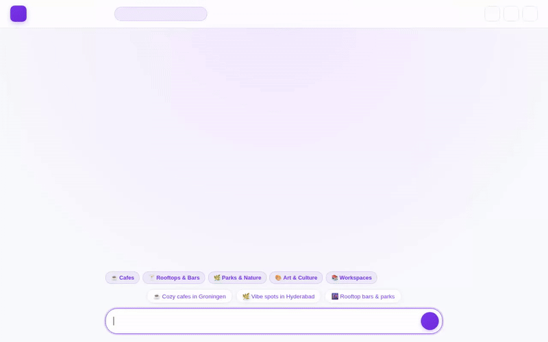

# Vibe Now — AI Local Discovery & Atmosphere Agent



**Vibe Now** is an autonomous instant travel guide and local atmosphere assistant built with the **Google Agent Development Kit (ADK)**. It helps travelers and locals discover venues, cozy spots, and local atmospheres matched to their mood, location, and dietary/allergy preferences.

---

## 🌟 Implemented Features & Architecture

Vibe Now is built directly on Google Cloud infrastructure and Vertex AI models. The capabilities implemented in this repository include:

### 🧠 Persistent User Memory (Vertex AI Memory Bank)
- **Durable Preferences & Allergies**: Uses `VertexAiMemoryBankService` and `PreloadMemoryTool` alongside an `after_agent_callback` (`generate_memories_callback`).
- **Safety First**: Automatically extracts and persists user dietary requirements, food/environmental allergies, and past visited places across sessions, cross-referencing remembered allergies before recommending any place or dish.

### 🗄️ Curated Local Spot Database (Google Cloud Firestore)
- **Database Search & Storage**: Connects directly to Firestore (`vibe-db` database, `vibe_spots` collection) via `get_vibe_spots` and `add_vibe_spot`.
- **Spot Discovery**: Queries curated spots by city (e.g., Groningen, San Francisco) and vibe tags (e.g., cozy, coffee, chill, scenic, nightlife).

### 🎨 AI Image Generation (Google `gemini-3.1-flash-lite-image`)
- **Travel Postcard Imagery**: `generate_vibe_image` generates high-quality postcard images of recommended places in the global region.
- **Dual Destination Saving**: Automatically saves generated images into the Playground's Artifacts panel (`tool_context.save_artifact`) and uploads image bytes directly to a public **Google Cloud Storage** bucket (`vibe-now-media-bucket`).

### 🎥 AI Video Snippets (Google `gemini-omni-flash-preview`)
- **Atmospheric Highlights**: `generate_vibe_video` generates short video tours and highlights of spots using Google's `gemini-omni-flash-preview` model in the global region.
- **Artifact & Storage Muxing**: Saves video clips to Playground Artifacts and uploads raw video bytes to public Cloud Storage, returning public HTTPS URLs.

### 📱 Agent-to-User Interface (A2UI v0.8)
- **Rich Card Components**: Incorporates `a2ui-agent-sdk` (`A2uiSchemaManager` & `a2ui_callback`) to render structured UI components (`Card`, `Column`, `Row`, `Text`, `Image`).
- **Responsive Layout**: Renders directly in the single-page web client without requiring manual prose formatting.

### 📍 Maps, Places & Geolocation
- **Google Places API (New)**: `searchNearby` queries nearby venues by type (cafes, restaurants, parks, museums) with exact coordinates and ratings.
- **Google Maps Geocoding**: `geocode_address` converts street addresses and landmarks into latitude and longitude coordinates.
- **Geolocation Fallback**: `get_current_location` detects system IP location when coordinates are not provided by the user.

### ⛅ Real-Time Weather Integration
- **Live Atmosphere Check**: `get_live_weather` fetches real-time temperature, wind speed, and weather conditions via the Open-Meteo API.

### 🐍 Secure Code Execution
- **Agent Engine Sandbox**: `execute_python_code` executes custom Python scripts safely inside the `AgentEngineSandboxCodeExecutor` environment.

---

## 🚧 Planned / Not Yet Implemented

- **Real-Time Transit & Flight Tracking**: Direct API integration for live train schedules and flight delay updates.
- **Native In-Browser Audio Streaming**: Direct streaming of ambient soundscapes inside chat turns without external video muxing.

---

## 🚀 Local Setup & Running Instructions

### Prerequisites

1. **Python 3.11+** installed.
2. **Google Cloud SDK (`gcloud`)** authenticated with an active project.
3. Installed `uv` or `pip`.

### 1. Environment Setup

Create a `.env` file in the project root:

```bash
GOOGLE_GENAI_USE_VERTEXAI=true
GOOGLE_CLOUD_PROJECT=your-gcp-project-id
GOOGLE_CLOUD_LOCATION=us-east1
GOOGLE_MAPS_API_KEY=your-google-maps-api-key
```

### 2. Install Dependencies

Install all required Python packages using `uv`:

```bash
uv sync
```

### 3. Initialize Firestore Sample Data (Optional)

Seed the `vibe-db` database with sample local spot recommendations:

```bash
uv run python seed_firestore.py
```

### 4. Start the Web Frontend & Agent Server

Launch the web server locally on port 8080:

```bash
AGENT_DIRECTORY=app \
GOOGLE_GENAI_USE_VERTEXAI=true \
GOOGLE_CLOUD_PROJECT=your-gcp-project-id \
GOOGLE_CLOUD_LOCATION=us-east1 \
PORT=8080 \
uv run python frontend/main.py
```

Open your browser and navigate to `http://localhost:8080` (or `http://127.0.0.1:8080`) to interact with Vibe Now.

---

## 🛠️ Project Structure

```
.
├── README.md                  # Project documentation & architecture summary
├── demo.gif                   # Looping demo recording of Vibe Now
├── agents-cli-manifest.yaml   # Agents CLI configuration & deployment target
├── pyproject.toml             # Python dependencies & build config
├── seed_firestore.py          # Firestore database seeding script
├── app/
│   ├── agent.py               # Core ADK Agent, Memory Bank, Firestore & AI tools
│   └── a2ui_utils.py          # A2UI callback transformer
└── frontend/
    ├── main.py                # FastAPI / A2A HTTP server for local hosting
    └── static/
        └── index.html         # Custom dark glassmorphic web UI
```
